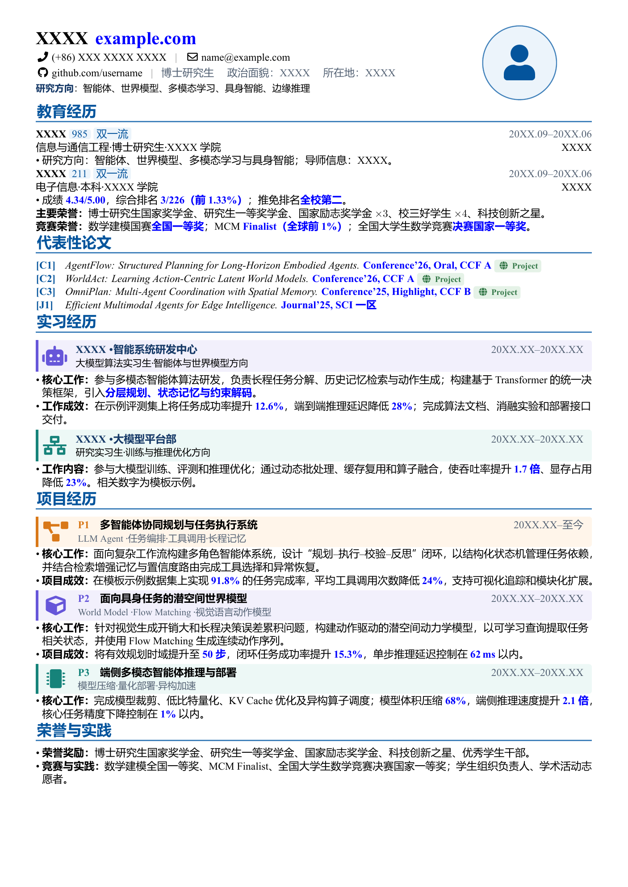

# OpenCurve Resume Template / 中文学术技术简历模板

[](https://github.com/wsp666/CampusRecruit-Resume/stargazers)
[](LICENSE)
[](https://www.overleaf.com/)

一份适合中文学术、算法、人工智能和工程岗位的单页 LaTeX 简历模板。模板保留了 OpenCurVe 的清晰结构，并加入彩色项目卡片、论文高亮、Project 链接框、中文字体回退和可替换头像占位符。

A one-page LaTeX resume template for academic, AI, research, and engineering roles. It keeps the clean OpenCurVe structure and adds colored project banners, publication highlights, Project badges, Chinese font fallbacks, and a privacy-safe portrait placeholder.

> 如果这个模板对你有帮助，欢迎点一个 **Star**。你的支持会帮助更多人发现和改进它，谢谢！
>
> If this template helps you, please consider giving it a **Star**. Thank you for supporting the project!

## Preview / 效果预览



生成的示例文件可以直接查看：[resume.pdf](resume.pdf)。所有姓名、联系方式、学校、作者和单位均为占位内容；项目指标也是演示数据，请务必替换为真实信息。

The compiled example is available as [resume.pdf](resume.pdf). Names, contacts, institutions, authors, employers, and project metrics are placeholders. Replace every example with truthful information before use.

## Features / 模板特点

- A4 单页布局，适合中文信息密度较高的技术简历。
- 支持 XeLaTeX、LuaLaTeX 和 Tectonic。
- 教育、论文、实习、项目、荣誉均拆分为独立文件，修改简单。
- 保留 `\bluebf`、`\greenbf`、`\mybox`、论文 Project box 等高亮命令。
- 实习和项目支持彩色图标、品牌色侧边条与同色浅背景。
- 默认不包含真实头像，使用 Font Awesome 中性头像占位符。
- 内置中文字体回退：优先使用 Microsoft YaHei，否则使用 FandolHei。

## Repository structure / 文件结构

```text
.
├── resume.tex                 # Main document / 主文件
├── open-curve.sty             # Layout, colors, helper commands / 样式与命令
├── sections/
│   ├── education.tex          # Education / 教育经历
│   ├── papers.tex             # Publications / 代表性论文
│   ├── experience.tex         # Internships / 实习经历
│   ├── projects.tex           # Projects / 项目经历
│   └── honors.tex             # Honors / 荣誉与实践
├── assets/
│   └── preview.png            # README preview / README 预览图
├── resume.pdf                 # Compiled example / 编译示例
└── LICENSE
```

## Use with Overleaf / 在 Overleaf 中使用

1. 点击 GitHub 页面右上方 **Code → Download ZIP**。
2. 打开 Overleaf，选择 **New Project → Upload Project**，上传 ZIP。
3. 在 **Menu → Compiler** 中选择 **XeLaTeX**。
4. 确认 **Main document** 为 `resume.tex`。
5. 修改 `resume.tex` 中的页眉信息，再依次编辑 `sections/` 中的内容。
6. 点击 **Recompile**。如果内容超过一页，优先精简文字，再调整字号和间距。

English steps:

1. Choose **Code → Download ZIP** on GitHub.
2. In Overleaf, select **New Project → Upload Project** and upload the ZIP.
3. Set **Menu → Compiler** to **XeLaTeX**.
4. Set the main document to `resume.tex`.
5. Edit the header in `resume.tex`, then replace the examples under `sections/`.
6. Click **Recompile**. If the resume exceeds one page, shorten the content before reducing font size.

## Use with Codex / 使用 Codex 自动迁移简历

把你的旧简历文件与本仓库放在同一工作区，然后将下面的提示词发送给 Codex。建议附上旧简历 PDF、Word 或 LaTeX 源文件。

### 中文提示词

```text
请使用当前工作区中的 OpenCurve-Resume-Template，将我的旧简历迁移到这个模板。

要求：
1. 严格保留事实，不虚构单位、论文、指标、时间或荣誉；不确定的信息请标记为“待确认”。
2. 保持原简历的讲述顺序，并按教育、论文、实习、项目、荣誉拆分到 sections/。
3. 使用 \bluebf 强调会议等级、关键技术、排名和量化结果；论文只给 Project 链接保留绿色 box。
4. 实习和项目使用模板中的彩色 Banner；如果我提供官方 Logo，则用 includegraphics 加载，并按 Logo 主色配置浅色背景。
5. 优化措辞，使每段体现“背景/职责或核心工作/结果”，但不要改变事实含义。
6. 使用 XeLaTeX 或 Tectonic 编译 resume.tex，渲染 PDF 检查重叠、裁切、分页和小字号可读性。
7. 最终交付可编辑 LaTeX 源文件、resume.pdf 和更新后的预览图。
8. 在提交或公开前扫描姓名、电话、邮箱、学校、导师、公司和本地绝对路径，避免泄露无意公开的信息。
```

### English prompt

```text
Use the OpenCurve-Resume-Template in the current workspace to migrate my existing resume into this design.

Requirements:
1. Preserve factual accuracy. Do not invent employers, papers, metrics, dates, or awards. Mark uncertain details as “TODO: confirm”.
2. Keep the original narrative order and place content in the education, papers, experience, projects, and honors files under sections/.
3. Use \bluebf for venue tiers, key technologies, rankings, and measurable outcomes. Keep the green box only for publication Project links.
4. Use the colored banner style for internships and projects. If official logos are supplied, load them with includegraphics and use a pale tint derived from each logo’s primary color.
5. Improve clarity using a context/responsibility or core work/result structure without changing the underlying facts.
6. Compile resume.tex with XeLaTeX or Tectonic, render the PDF, and check for overlap, clipping, awkward page breaks, and unreadably small text.
7. Deliver the editable LaTeX sources, resume.pdf, and an updated preview image.
8. Before publishing, scan for names, phone numbers, emails, schools, advisors, employers, and local absolute paths that were not intended for disclosure.
```

## Local compilation / 本地编译

### Tectonic

```bash
tectonic resume.tex
```

### XeLaTeX

```bash
xelatex resume.tex
xelatex resume.tex
```

The second XeLaTeX run updates references and layout state when needed.

## Common customization / 常用修改

| Goal / 目标 | File / 文件 | What to edit / 修改内容 |
|---|---|---|
| Name, contact, website / 姓名与联系方式 | `resume.tex` | `\leftheader` |
| Portrait / 头像 | `resume.tex` | Replace the placeholder under `\rightheader` with `\includegraphics` |
| Page margins / 页边距 | `open-curve.sty` | `geometry` options |
| Main blue / 主蓝色 | `open-curve.sty` | `OpenCurvePrimary`, `OpenCurveAccent` |
| Highlight commands / 高亮命令 | `open-curve.sty` | `\bluebf`, `\greenbf`, `\mybox`, `\linkbox` |
| Section spacing / 章节间距 | section files | Optional argument such as `\cvsection[0.7]{...}` |
| Banner colors / 卡片配色 | `open-curve.sty` | `AgentPurple`, `AgentTeal`, `AgentOrange` palettes |

### Add a portrait / 添加头像

Put your image at `assets/portrait.jpg`, then replace the `\rightheader` block in `resume.tex` with:

```tex
\rightheader{%
  \centering
  \includegraphics[width=2.3cm,height=2.6cm,keepaspectratio]{assets/portrait.jpg}%
}
```

### Add an official organization logo / 添加官方机构图标

Place a PNG file in `assets/` and use it inside a banner:

```tex
{\includegraphics[width=28pt,height=20pt,keepaspectratio]{assets/company-logo.png}}
```

Use the organization’s official brand asset where possible, preserve its aspect ratio, and choose a pale background so the text remains readable.

## Privacy checklist before publishing / 公开前隐私检查

- [ ] Replace or remove phone numbers and personal email addresses.
- [ ] Remove names, portraits, student IDs, home addresses, advisors, and references unless intentionally public.
- [ ] Confirm whether schools, employers, clients, and project partners may be disclosed.
- [ ] Remove confidential project data, internal system names, unpublished metrics, and private links.
- [ ] Search the entire repository, including PDF metadata, comments, logs, screenshots, and Git history.
- [ ] Do not commit LaTeX temporary files or local absolute paths.
- [ ] Recompile `resume.pdf` after sanitizing the source.

## Notes / 说明

- The example research projects and all numerical metrics are fictional and exist only to demonstrate layout.
- 本仓库中的智能体项目与数值指标均为排版示例，不代表任何真实个人、学校或企业。
- This repository is intended as a template. Verify every claim before submitting a resume.

## License

Released under the [MIT License](LICENSE). The project builds on the OpenCurVe/CurVe LaTeX ecosystem and uses Font Awesome icons through the `fontawesome5` package.

---

⭐ **Star the repository if it saved you time. Contributions and layout improvements are welcome.**

⭐ **如果这个模板节省了你的时间，欢迎 Star；也欢迎提交改进建议。**
